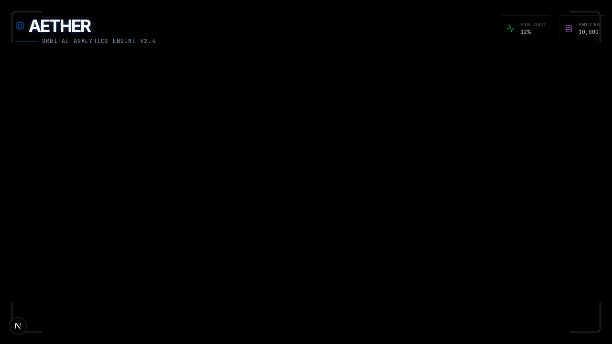

# Case Study: Aether - Orbital Analytics Engine

## Overview

Aether is a web-based application that provides a stunning 3D visualization of a galaxy, allowing users to explore and interact with a large dataset of particles. The application features a futuristic user interface with a chat interface that allows users to query the dataset and receive AI-powered responses.

## Technologies

- **Next.js:** A popular React framework for building server-rendered and statically-generated web applications.
- **Three.js:** A JavaScript library for creating and displaying 3D computer graphics in a web browser.
- **@react-three/fiber:** A React renderer for Three.js that makes it easy to create 3D scenes with React components.
- **Zustand:** A small, fast, and scalable state management solution for React.
- **Framer Motion:** A library for creating fluid animations in React.
- **Playwright:** A framework for end-to-end testing of web applications.

## Features

- **3D Galaxy Visualization:** Aether renders a beautiful 3D galaxy with thousands of particles, each with its own unique position, color, and size.
- **Interactive Tooltip:** Users can hover over individual particles to view a tooltip with more information.
- **Chat Interface:** A chat interface allows users to query the dataset and receive mock AI-powered responses.
- **Camera Controller:** The camera can be animated to focus on specific targets in the 3D scene.
- **Post-Processing Effects:** The application uses post-processing effects to create a more cinematic look.

## Challenges

- **Performance:** Rendering a large number of particles in a 3D scene can be a performance challenge. To address this, we used a variety of optimization techniques, such as using `BufferGeometry` to reduce the number of draw calls and using a shader material for custom particle rendering.
- **State Management:** The application's state is managed with Zustand, which makes it easy to share state between components and keep the application's state in sync.
- **Animations:** The application uses Framer Motion to create fluid animations for the UI components.

## Conclusion

Aether is a visually stunning and interactive web application that demonstrates the power of combining Next.js, Three.js, and other modern web technologies. The application is a great example of how to create a high-performance 3D visualization with a user-friendly interface.
